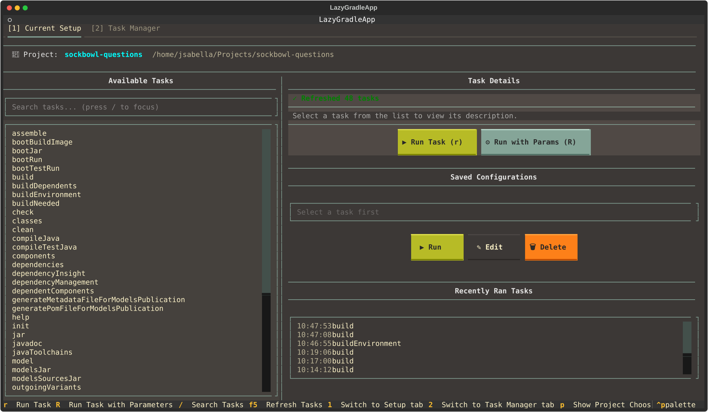
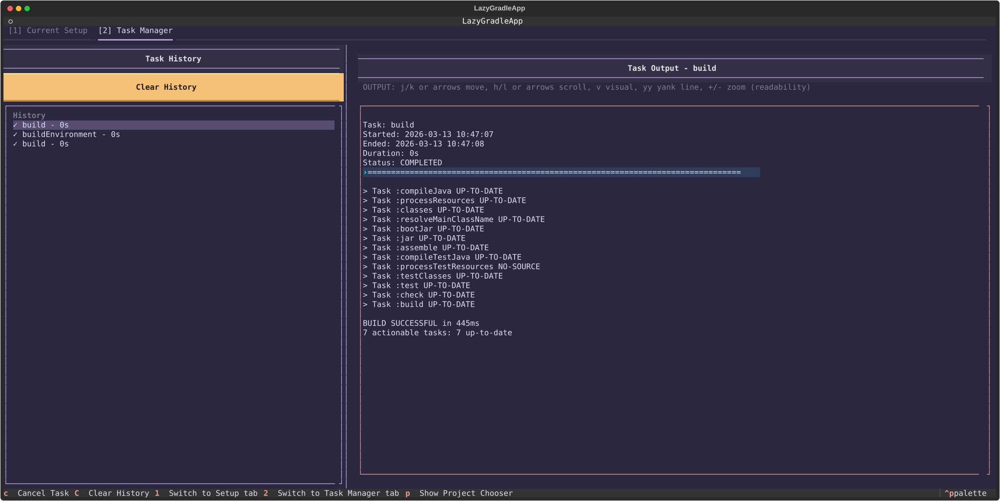
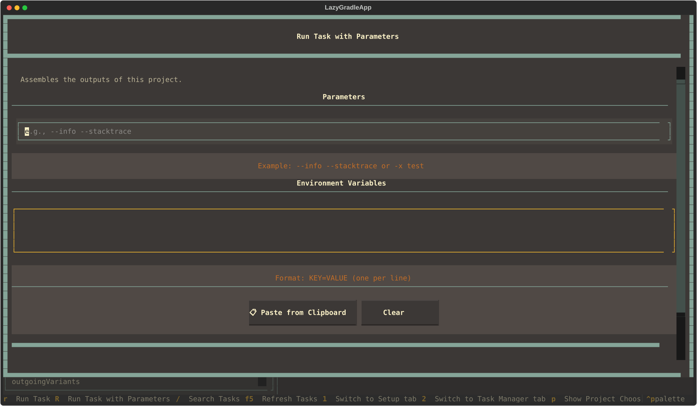
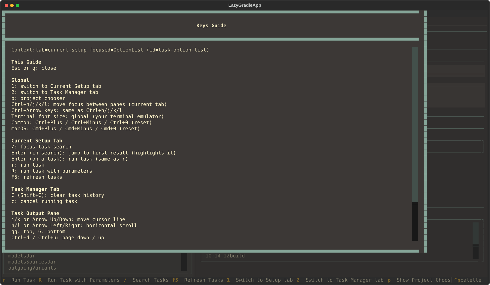

<a id="readme-top"></a>

[![Contributors][contributors-shield]][contributors-url]
[![Forks][forks-shield]][forks-url]
[![Stargazers][stars-shield]][stars-url]
[![Issues][issues-shield]][issues-url]
[![MIT License][license-shield]][license-url]

# lazygradle

`lazygradle` is a Textual-based TUI for browsing Gradle tasks, running them quickly, and reviewing task output without leaving the terminal.

It is built for the workflow of:

- keeping multiple Gradle projects cached and switchable
- searching a large task list quickly
- running tasks with or without saved parameter sets
- reviewing recent task history and output in a dedicated task manager tab
- staying mostly keyboard-driven

## Screenshots

### Current Setup



Browse available tasks, search with `/`, inspect task details, and run tasks or saved configurations from the same screen.

### Task Manager



Review task history on the left and inspect structured output on the right with vim-style motions, visual selection, yanking, and pane-focused navigation.

### Run With Parameters



Launch tasks with custom CLI flags and environment variables, then save those inputs as reusable configurations.

### Keys Guide



The command palette includes a contextual keys guide that explains global controls plus tab- and pane-specific actions.

## Highlights

- Multi-project support with cached Gradle metadata
- Fast task search and keyboard-first task execution
- Saved task configurations with parameters and environment variables
- Recent task history with re-run support
- Dedicated Task Manager tab for output review
- Vim-style Task Output navigation, visual selection, and yank support
- Contextual key guide from the command palette
- Optional file logging via environment variable

## Installation

### pip

```sh
pip install lazygradle
```

Run it with:

```sh
lazygradle
```

### From Source

```sh
git clone https://github.com/jacob-sabella/lazygradle.git
cd lazygradle
python -m venv .venv
source .venv/bin/activate
pip install -r requirements.txt
python app.py
```

## Requirements

- Python 3.13+
- A Gradle project
- Either a working `gradlew` wrapper in the project or `gradle` available on `PATH`

## Quick Start

1. Launch `lazygradle`.
2. Press `p` to open the project chooser.
3. Add or select a Gradle project.
4. Use `/` to focus task search on the Current Setup tab.
5. Press `r` to run the highlighted task or `R` to run it with parameters.
6. Press `2` to open Task Manager and inspect recent runs and output.

## Keyboard Workflow

### Global

- `1` / `2` switch between tabs
- `p` opens the project chooser
- `Ctrl+h/j/k/l` moves between panes in the active tab
- `Ctrl+Arrow` keys do the same pane movement if you prefer arrows

### Current Setup

- `/` focuses the task search input
- `Enter` in search jumps to the first result
- `r` runs the selected task
- `R` runs the selected task with parameters
- `F5` refreshes the task list

### Task Output

- `j` / `k` or arrow up/down move the cursor line
- `h` / `l` or arrow left/right scroll horizontally
- `gg`, `G`, `Ctrl+d`, `Ctrl+u`, `0`, `$` work as expected
- `v` toggles visual mode
- mouse drag also enters visual selection
- `y` yanks the current visual selection
- `yy` yanks the current line
- `+` / `-` adjusts readability zoom for the output pane

## Logging

Logging is disabled by default.

Enable it by setting `LAZYGRADLE_LOG_FILE`:

```sh
LAZYGRADLE_LOG_FILE=1 lazygradle
```

That writes to `lazygradleapp.log` in the current directory. You can also provide an explicit path:

```sh
LAZYGRADLE_LOG_FILE=~/.local/state/lazygradle/app.log lazygradle
```

`LAZYGRADLE_LOG_LEVEL` is also supported. When logging is enabled, it defaults to `DEBUG`.

## Configuration

Project state is stored in:

```text
~/.config/lazygradle/gradle_cache.json
```

That cache includes saved projects, recent task history, saved run configurations, theme selection, and Task Output settings.

## Contributing

Issues and pull requests are welcome.

If you want to contribute:

1. Fork the repository
2. Create a feature branch
3. Make the change
4. Open a pull request

## License

Distributed under the MIT License. See [LICENSE](LICENSE).

## Acknowledgments

- [Textual](https://textual.textualize.io/)
- [Rich](https://github.com/Textualize/rich)
- [Shields.io](https://shields.io/)

[contributors-shield]: https://img.shields.io/github/contributors/jacob-sabella/lazygradle.svg?style=for-the-badge
[contributors-url]: https://github.com/jacob-sabella/lazygradle/graphs/contributors
[forks-shield]: https://img.shields.io/github/forks/jacob-sabella/lazygradle.svg?style=for-the-badge
[forks-url]: https://github.com/jacob-sabella/lazygradle/network/members
[stars-shield]: https://img.shields.io/github/stars/jacob-sabella/lazygradle.svg?style=for-the-badge
[stars-url]: https://github.com/jacob-sabella/lazygradle/stargazers
[issues-shield]: https://img.shields.io/github/issues/jacob-sabella/lazygradle.svg?style=for-the-badge
[issues-url]: https://github.com/jacob-sabella/lazygradle/issues
[license-shield]: https://img.shields.io/github/license/jacob-sabella/lazygradle.svg?style=for-the-badge
[license-url]: https://github.com/jacob-sabella/lazygradle/blob/main/LICENSE
